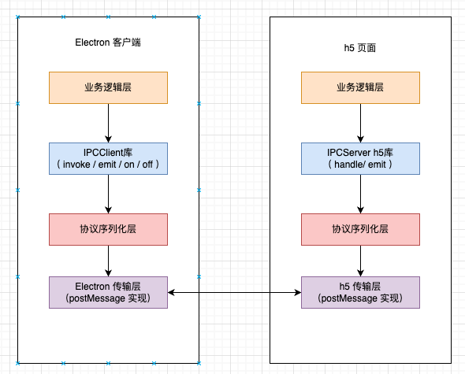
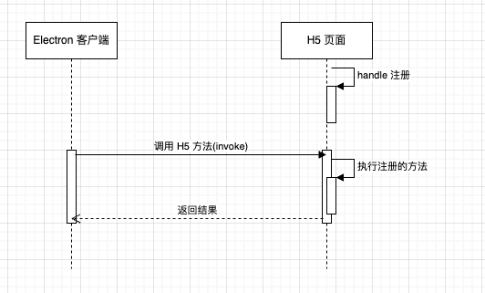
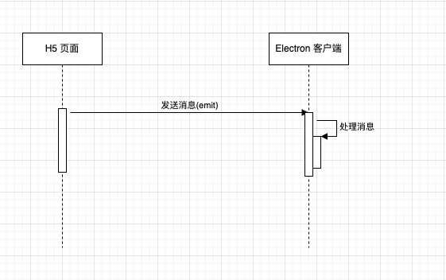
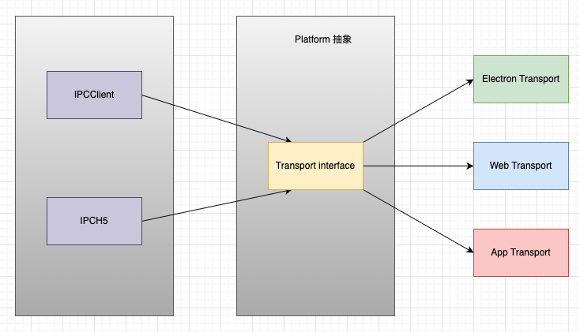

## 分层架构图


## 通信时序图




## 协议设计
#### 消息格式
```typescript

interface IPCMessageBase {
  reqId: string;
  channel: string;
  type: 'request' | 'response' | 'event'
}
 
interface RequestMessage extends IPCMessageBase {
  type: 'request';
  method: string;
  params: any[];
}
 
interface ResponseMessage extends IPCMessageBase {
  type: 'response';
  result?: any;
  error?: {
    code: number;
    message: string;
  };
}
 
interface EventMessage extends IPCMessageBase {
  type: 'event';
  event: string;
  data?: any;
}
 
type IPCMessage = RequestMessage | ResponseMessage | EventMessage;
```

## IPC API层
#### Electron客户端API
```typeScript
interface IPCClientAPI {
  invoke(channel: string, ...args: any[]): Promise<any>;
  on(channel: string, listener: (data: any) => void): void;
  off(channel: string, listener?: (data: any) => void): void;
}
```

#### H5 API
```typescript
interface IPCServerAPI {
  handle(channel: string, handler: (...args: any[]) => any): void;
  emit(channel: string, data?: any): void;
}
```

## 通用传输层API 
```typeScript
interface ITransport {
 send(message: IPCMessage): void;
 onMessage(callback: (message: IPCMessage) => void): void;
}
```
## 平台适配


## 使用示例
Electron客户端使用

```typescript
import { IPCClient } from '@casstime/copilot-web-sdk';
 
// 初始化 IPC
const ipc = new IPCClient(window);
 
 // 监听H5事件
  ipc.on('h5Event', (data) => {
    console.log('Received event from H5:', data);
  });
   
  // 调用H5方法
  async function getUserData() {
    const userData = await ipc.invoke('getUserInfo');
  }
```


H5页面使用
```typescript
import { IPCServer } from '@casstime/copilot-web-sdk';
   
  // 初始化IPC
  const ipc = new IPCH5();
   
  // 注册方法供客户端调用
  ipc.handle('getUserInfo', async () => {
    return {
      name: 'xxx',
      phone: '13888888888'
    };
  });
   
  // 发送初始化完成事件
  window.addEventListener('load', () => {
    ipc.emit('h5Ready', { version: '1.0.0' });
  });
```